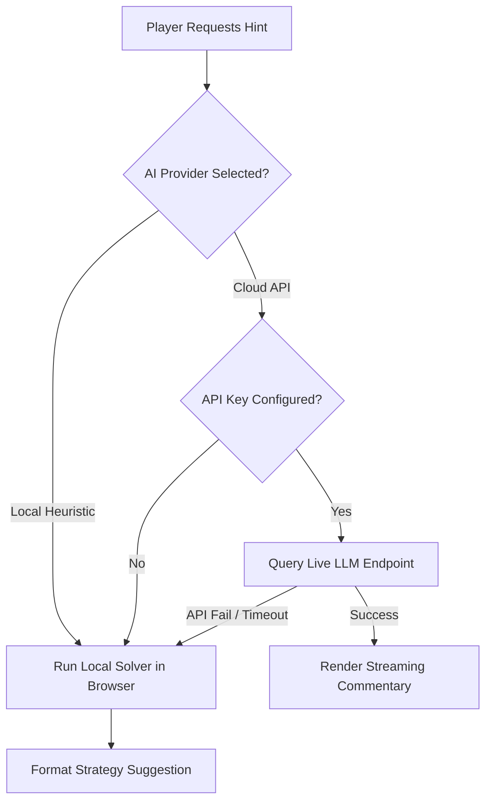

# 🧠 Nova AI Arcade

A premium, glassmorphic suite of classic games (Chess, Ludo, and Gem Crush) equipped with a **Hybrid AI Coaching Engine** that provides real-time tactical advice, matches, and gameplay strategy.

Designed with rich visual aesthetics, smooth animations, sound effects, and a serverless frontend architecture.

---

## 🎮 Play Now (One Click)

**▶️ [Play in your browser](https://YOUR_USERNAME.github.io/Nova-Ai-Arcade/)** — no install needed.

> Replace `YOUR_USERNAME` with your GitHub username once the repo is published. The site auto-deploys on every push via GitHub Actions.

---

## 🚀 Key Features

*   **Chess Royale**: Full piece-move validation, path overlays, pawn promotion, capture highlights, and an integrated Chess Coach.
*   **Ludo Classic**: Supports 2 to 4 players (human/bot customizable) on a modern board. Features smart capture animations, safe-star zones, and roll-again rules.
*   **Gem Crush**: Swap sparkling gems to match 3 or more, trigger satisfying cascades, and clear objectives before your moves run out.
*   ** central AI Setup Panel**: Select between local heuristics or three cloud-based LLM APIs directly in your browser.

---

## 🤖 How the AI Coach Works

The arcade runs on a **hybrid intelligence system**. It is designed to work immediately out of the box with zero configuration, while allowing developers to easily plug in live cloud APIs.



### 1. Keyless Default: Nova Local AI (100% Free & Offline)
*   **Default Setting**: The arcade starts in **`🟢 AI: LOCAL`** mode.
*   **Zero Setup**: Requires no registration, accounts, credit cards, or API keys.
*   **Heuristics Engine**:
    *   **Chess**: Evaluates pseudo-legal board coordinates using minimax capture priorities to recommend strategic captures or center-control pawn pushes.
    *   **Ludo**: Checks path rolls, safety tiles, and yard statuses to alert players to incoming captures or recommend optimal tokens to advance.
    *   **Gem Crush**: Simulates vertical/horizontal swaps on a copy of the board to find swaps that guarantee matches, returning the exact coordinates and matched gem name.

### 2. Live Cloud AI APIs (Developer Sandbox)
Click the **`🟢 AI: LOCAL`** badge in the header to connect to any of the following live endpoints:

| Provider | Model Used | API Sandbox / Dashboard | Notes |
| :--- | :--- | :--- | :--- |
| **Google Gemini** | `gemini-1.5-flash` | [Google AI Studio](https://aistudio.google.com/) | Standard free-tier developer API. |
| **Groq Cloud** | `llama-3.1-8b-instant` | [Groq Console](https://console.groq.com/) | High-speed inference (ideal for immediate suggestions). |
| **OpenRouter** | `meta-llama/llama-3-8b-instruct:free` | [OpenRouter Keys](https://openrouter.ai/) | No credit card required; queries open-source models. |

*Keys are stored securely in browser `localStorage` and sent directly to the providers' official REST endpoints.*

---

## ⚡ Game Quality-of-Life Automations

### Ludo Move Automation
*   **Single Move Auto-Walk**: If you roll a number that leaves you with exactly **one** legal move, the game will automatically walk that token for you after `600ms`.
*   **Home Stretch Auto-Finish**: Once three of your tokens enter the finish cell, any roll automatically advances your remaining fourth token.

### Candy Crush Match Verification
*   **Match Accuracy**: Evaluates matched arrays post-simulation to ensure suggested match names (e.g. `💎 Diamond`, `🍇 Grapes`) represent the newly created combinations rather than pre-existing matches.

---

## 🛠️ Installation & Setup

### Requirements
*   [Node.js](https://nodejs.org/) (v18 or higher recommended)
*   Python 3.x (optional, for lightweight local server hosting)

### Quick Start
1.  Install dependencies:
    ```bash
    npm install
    ```
2.  Start the local dev server:
    ```bash
    npm run dev
    ```
3.  Open `http://localhost:5173` in your browser.

### Hosting or Building
*   To build the optimized static production folder (`dist/`):
    ```bash
    npm run build
    ```
*   To serve the production build locally via Python, run:
    ```cmd
    run_game.bat
    ```
    *(Launches a TCPServer on port `8000` and opens `http://localhost:8000` automatically)*

---

## ⚙️ Development Scripts
*   `npm run dev` — Launches Vite dev server.
*   `npm run build` — Compiles and builds files to `dist`.
*   `npm run lint` — Runs static validation checks (`oxlint`).
